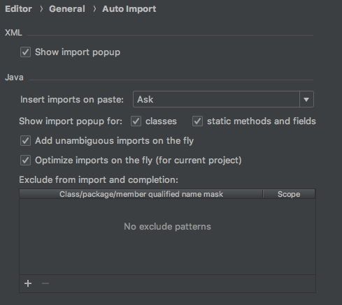
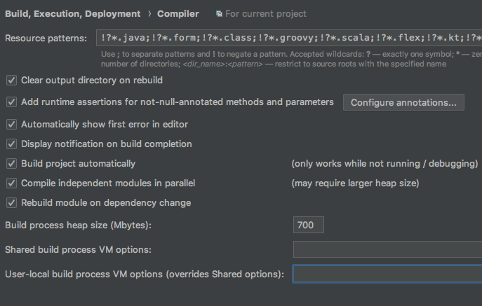

# intelliji configuration
This repo contains configuration that I used for intelliji projects.

- [intelliji configuration](#intelliji-configuration)
    - [Code style](#code-style)
    - [Inspections](#inspections)
    - [Activation of auto-import](#activation-of-auto-import)
    - [Build project automatically](#build-project-automatically)
    - [Color scheme](#color-scheme)
    - [Plugins to install](#plugins-to-install)

----
## Code style
To import code style :
-  Open preferences window
-  Go to **Editor > Code Style**
-  Import the file **src/configuration-code_style.xml** into the scheme
-  You are now using tpoi_code_style
-  Click OK to save settings
----
## Inspections
To import inspections rules : 
-  Open preferences window
-  Go to **Editor > Inspections**
-  Import the file **src/configuration-inspections.xml** into the profile
-  You are now using tpoi_inspections
-  Click OK to save settings

----
## Activation of auto-import
Default configuration doesn't active auto-import.
To activate : 
-  Open preferences window
-  Go to **Editor > General > Auto Import**
-  Select *"Add unambiguous imports on the fly"* and *"Optimize imports on the fly (for current project)"*
-  Click OK to save settings

----
## Build project automatically
Default intelliji configuration doesn't build project automaticaly, to activate : 
-  Open preferences window
-  Go to **Build, Execution, Deployement > Compiler**
-  Check *"Build project automaticaly"*
-  Click OK to save settings

----
## Color scheme
The color scheme I use is Tommorow Night available in this [github](https://github.com/chriskempson/tomorrow-theme/tree/master/JetBrains)

----
## Plugins to install
- Grep console : Highlight error in console (can be found in intelij plugin repository)
